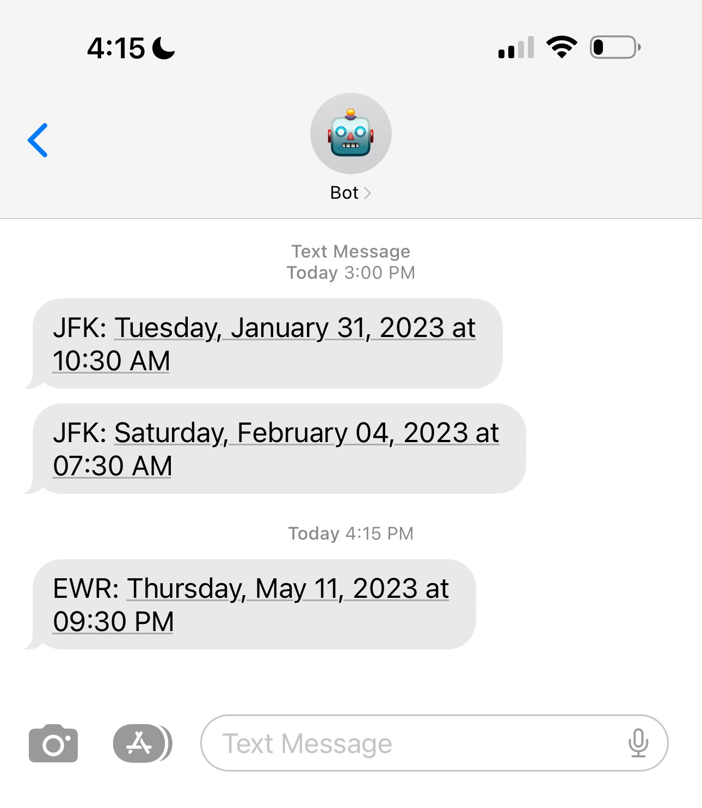

# Global Entry Alerter

## Problem
Booking an appointment for a [Global Entry](https://www.cbp.gov/travel/trusted-traveler-programs/global-entry) interview is hard, especially in cities with high demand like SF or NYC. 

If you check for open appointments, there is typically nothing available for weeks, sometimes even months. 
However, appointments _are_ actually constantly opening up, they just get booked very quickly.

This project polls the DHS Scheduler API for open Global Entry appointments, notifying you whenever a new one opens up.
If the new appointment is convenient for you, book it immediately — otherwise it will be gone within a few minutes.

This project is not affiliated with U.S. Customs and Border Protection or the U.S. Department of Homeland Security.


### Example Usage


## Requirements
1. A Twilio account with the ability to send programmable SMS. See [here](https://www.twilio.com/docs/sms/quickstart/python).
2. Python 3 & [Poetry](https://python-poetry.org/docs/) installed (if running manually on your own computer), OR a [Render](https://render.com) account (if using one-click deploys, see below)

## Running Locally
To install the project:
```bash 
$ git clone https://github.com/grahamplace/global-entry-alerter.git
$ cd global-entry-alerter
$ poetry install
```

To run the project:
1. Copy `example_config.toml`, rename to `config.toml`
2. Configure `config.toml` as needed (see Configuration below)
3. Set the following env variables using your Twilio account:
   - `TWILIO_AUTH_TOKEN`
   - `TWILIO_ACCOUNT_SID`
   - `TWILIO_PHONE_NUMBER`
4. `poetry run global-entry-alerter`


## One-Click Deploys to Render
TODO

## Configuration
The project uses `config.toml` for all configuration.

See `example_config.toml` as a reference for your `config.toml`

| Setting                  | Description                                                                                                                                                                                                                                                           |                     Example Value |
|:-------------------------|:----------------------------------------------------------------------------------------------------------------------------------------------------------------------------------------------------------------------------------------------------------------------|----------------------------------:|
| `fetching.lookahead_weeks` | How many weeks from today to check for open appointments. E.g. if you want an appointment in the next month, use 4 weeks                                                                                                                                              |                                 4 |
| `fetching.wait_seconds`    | The interval between checks for open appointments. It is best to use a value <= 60                                                                                                                                                                                    |                                10 |
| `fetching.locations`       | Which Global Entry interview locations to check. Accepts many locations for use cases where multiple locations are feasible (e.g. EWR or JFK if you live in NYC). See [here](https://github.com/oliversong/goes-notifier#goes-center-codes) for the full set of codes | `[{ name = "JFK", code = 5140 }]` |
| `sending.to_numbers`       | The phone numbers to send alerts to. Include +1 (or whatever country code)                                                                                                                                                                                            |                  `["+15207809135"]` |


## Development

### Pre-commit hooks
This project uses [pre-commit](https://pre-commit.com) to enforce linting on all commits. Install it with:
```bash
$ poetry run pre-commit install
```

### Formatting
This project uses [black](https://github.com/psf/black) and [flake8](https://flake8.pycqa.org/en/latest/) to enforce a consistent style.
To format the project according to the rules, run:
```bash
make format
```

### Test Mode
Running in test mode will fetch appointments using the settings in `config.toml`, but will not actually send alerts.
Use this when developing to avoid incurring Twilio costs:
```bash
poetry run global-entry-alerter --test 
```

